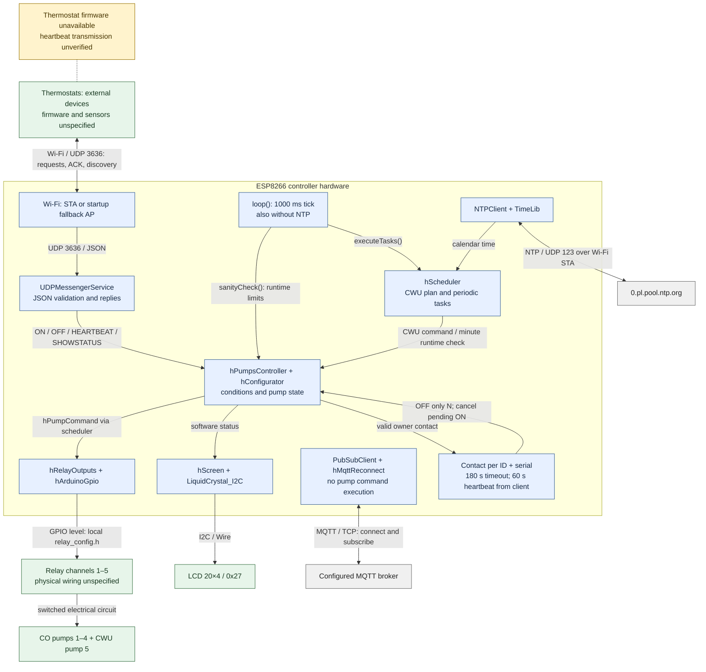
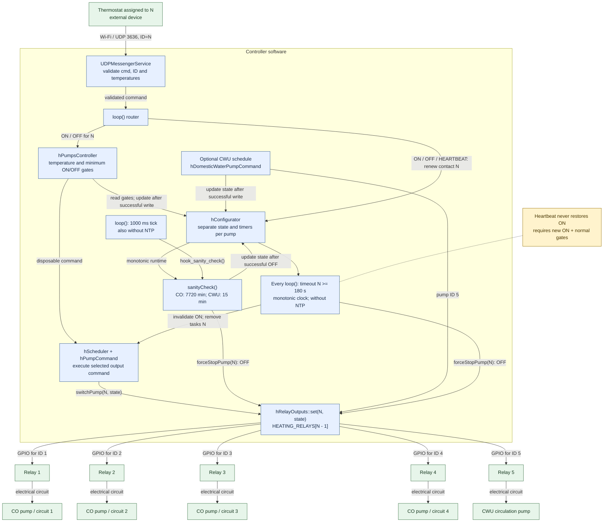

# Controller architecture

[Polski](ARCHITECTURE.pl.md) | English | [README](../README.md)

This document describes the controller sources in `heating_server/`.
Thermostats are external clients whose firmware, boards and sensor models are
not identified in this repository. The diagrams show software and intended
hardware roles; physical relay wiring is not confirmed and example outputs
are unconfigured.

## Components

| Component | Responsibility and source |
| --- | --- |
| ESP8266 controller | `setup()` and `loop()` in [heating_server.ino](../heating_server/heating_server.ino); startup, command routing, periodic servicing |
| UDP service | [udpmessengerservice.cpp](../heating_server/udpmessengerservice.cpp): JSON validation, pending command, replies and discovery |
| Pump controller | `hPumpsController` in [scheduler.cpp](../heating_server/scheduler.cpp): ON/OFF conditions, runtime limits and CWU schedule registration |
| Scheduler | `hScheduler` in [scheduler.h](../heating_server/scheduler.h): owns up to 512 tasks; minute, hour, day, week and month schedules |
| State/configuration | `hConfigurator` in [heating_config.cpp](../heating_server/heating_config.cpp): pump state, monotonic runtime, switch history and MQTT status; constants in [heating_config.h](../heating_server/heating_config.h) |
| Relay output | [relay_output.cpp](../heating_server/relay_output.cpp): validates channels, initializes OFF, translates pump ID into GPIO and active level; no physical feedback |
| Display | [screen.cpp](../heating_server/screen.cpp): LCD status through LiquidCrystal_I2C, 20×4 at 0x27 |
| Network/time | [utils.cpp](../heating_server/utils.cpp) and [runtime.h](../heating_server/runtime.h): startup Wi-Fi/AP, NTP and MQTT reconnect |
| CWU schedule | [createDailyPlan.cpp](../heating_server/createDailyPlan.cpp): optional daily circulation schedule |

Blue nodes represent software, green nodes hardware, grey nodes external
network services and yellow notes implementation limits.



MQTT is a connection present in firmware, not a pump-control path. The default
broker port is 1883 in `heating_config.h`; local configuration can override it.
`mqttCallback()` only logs an unsupported command for the configured topic
and bounded input (≤512 B). It does not decode a control schema or switch
outputs. `formatThermostatTopic()` formats `heating/sensors/thermostatN`
with the configured prefix, but `loop()` only prints it.
`setTempFromMQTT()` can construct a UDP `MQTTSET` broadcast; no firmware
caller connects it to the callback, and `MQTTSET` is not an accepted inbound
controller command.

## Thermostat → circuit → pump mapping

The wire `ID` selects pump N (1–4), and `serial` must match entry N in
local `HEATING_THERMOSTAT_SERIALS`. Physical room and circuit assignment
remains installation configuration.

| Request ID | Logical circuit / pump | Relay configuration row |
| --- | --- | --- |
| 1 | CO 1 | `HEATING_RELAYS[0]` |
| 2 | CO 2 | `HEATING_RELAYS[1]` |
| 3 | CO 3 | `HEATING_RELAYS[2]` |
| 4 | CO 4 | `HEATING_RELAYS[3]` |
| 5 | CWU circulation; status only over UDP | `HEATING_RELAYS[4]` |

The parser validates ID and temperature representation; HEARTBEAT requires
ID 1–4 and a positive 32-bit serial. The router permits ON/OFF only for
IDs 1–4 assigned to that serial; SHOWSTATUS covers IDs 1–5.
`hRelayOutputs::set()` checks bounds before selecting row `pumpId - 1`.
`hConfigurator::registerClient()` registers local assignments, rejecting
invalid IDs, zero, duplicate serials and changes to an existing owner.
Packets never register clients. `serial` is copied into the command;
`versionC` and humidity are ignored. Sender IP/port address the reply,
so an IP change on reconnect does not change ownership. UDP has no authentication:
serial matching prevents accidental client mixups but can be spoofed.
The protocol has no sequence number or packet replay protection.

Each pump has its own running state, runtime and minimum-switch interval.
An ON/OFF request for N operates on N; `sanityCheck()` inspects each pump
separately. `_PRIORITY_ARRAY` is declared but implements no arbitration or
limit on simultaneous circuits. The controller, network and loop are shared;
per-pump state does not guarantee isolation from a stalled controller.

## Circuit control components

The parameter N in this diagram is the request `ID` (1–4). Controller timeout
works independently per circuit; heartbeat transmission belongs to the external thermostat.



The GPIO/electrical edges describe the configured output chain, not verified
wiring. With the example configuration all channels are `UNCONFIGURED`.

## Request and switching flow

1. `listen()` receives one datagram, and `processMessage()` publishes a
   validated, owned `tClientCommand`. Invalid input leaves the pending command
   and its reply address unchanged.
2. `loop()` takes the command and dispatches ON/OFF to
   `turnOnHeatPumpReq()` / `turnOffHeatPumpReq()`.
3. ON requires a stopped pump, finite temperatures, permission from
   `canRestartPump()` and both inequalities:
   `actualTEMP <= targetTEMP + 0.7 + tempModifier` and
   `actualTEMP <= 28 + tempModifier`.
   With a set clock, `tempModifier=1` at hours 11–13,
   `tempModifier=-2` at hours 23–05; otherwise it is 0. Hours 22 and 06
   are outside the night interval. The controller does not independently start
   a pump from stored temperatures without an ON request.
4. OFF requires a running pump, finite temperature fields and permission from
   `canStopPump()`; it has no temperature threshold. The current minimum ON
   and OFF interval is **1 minute** (`_MIN_MINUTS_FROM_LAST_START`).
   `_DISABLE_MAX_ONOFF_VALIDATION=false` keeps those gates enabled.
   The first ON after controller startup has no preceding OFF interval.
5. A disposable `hPumpCommand` goes through `addExecuteTask()` and writes
   the selected relay output. A full scheduler, allocation failure or output
   rejection returns failure. Only successful execution updates pump state.
   Duplicate ON for a running pump and OFF for a stopped pump return `NO`.
6. The controller replies to the requesting IP/port with the resulting
   software and output states. Receipt of an ACK does not prove pump operation.

`sanityCheck()` runs from a monotonic 1000 ms tick in `loop()` (and a
minute-based scheduler callback). It stops each running CO pump at
`_MAX_HEATING_PUMP_RUNNING_MINUTES=7720` and CWU at
`_DOMESTIC_WATER_PUMP_RUN_MINUTS=15`. Forced OFF bypasses the normal
minimum-ON gate and scheduler capacity. A failed OFF preserves state/timers,
so the next check retries. Runtime and minimum intervals use extended
`millis()`, tolerating a single 32-bit rollover between updates and NTP jumps.
The tick is serviced by `loop()`, not an independent hardware watchdog.

## Communication loss and return

The approved contract is a heartbeat every **60 s**, including without heat
demand, and a **180 s** timeout. Controller 0.3.0 implements HEARTBEAT reception
and timeout; thermostat firmware sources are absent from this repository,
so transmission and client reconnect are neither implemented nor verified here.

Every valid HEARTBEAT, ON or OFF from the assigned thermostat renews N's
last contact, including a request rejected by normal control conditions.
SHOWSERVER, SHOWSTATUS, invalid packets, unknown IDs, wrong serials and
another client's traffic do not sustain N. Discovery never registers clients.
`checkThermostatTimeouts()` runs on every `loop()` iteration before the scheduler
and reception of the next packet, also without network traffic or NTP.
At >= 180 000 ms without contact, the controller revokes ON permission,
removes pending ON/OFF tasks for N and writes OFF through the driver, bypassing
minimum ON time and scheduler capacity. A request generation also blocks a
retained old command after a later ON is accepted. Other CO circuits and the
CWU schedule remain independent. If OFF writing fails, output state remains
unchanged, ON is blocked and the next iteration retries OFF.

HEARTBEAT after timeout renews contact but never starts the pump or restores
old ON. A new ON received after timeout must satisfy temperature gates and
the one-minute OFF interval after stopping. On restart, contact and request
memory is empty, configured outputs initialize OFF, and CO requires a valid
owner ON. The optional CWU schedule retains its separate logic. Contact loss
and recovery are logged once per transition. Time uses extended monotonic
`millis()` with rollover handling.

A compatible thermostat must transmit HEARTBEAT every 60 s using a monotonic
timer, without blocking delays and independently of heat demand. On reconnect
it must discard queued old ON requests; a new ON may result only from normal
logic and current conditions. Simulated packets in controller tests do not
establish that client behavior.

MQTT reconnect and NTP retry also use **60 000 ms**, but are separate mechanisms.
`MQTT_SOCKET_TIMEOUT=1` is a **1 s** response timeout;
`espClient.setTimeout(200)` is a **200 ms** DNS/TCP limit. MQTT remains
synchronous; a blocked loop delays timeout checks and circuit servicing.
Timeout is executed on the first serviced iteration at or after 180 s;
actual delays require hardware measurement.

## UDP protocol

UDP listens on **3636**. Every accepted request, including SHOWSERVER and
SHOWSTATUS, contains `cmd`, `ID`, `actualTEMP` and `targetTEMP`:

```json
{"cmd":"SHOWSTATUS","ID":1,"actualTEMP":20.0,"targetTEMP":21.0}
```

This status request does not switch an output. Command names are case-sensitive:

| cmd | Controller behavior |
| --- | --- |
| `ON` | Request ON for CO ID 1–4, subject to gates; unicast ACK |
| `OFF` | Request OFF for CO ID 1–4, subject to gates; unicast ACK |
| `HEARTBEAT` | Contact for assigned CO ID 1–4; renews timer, no switching; unicast ACK |
| `SHOWSTATUS` | Status for ID 1–5; valid ID yields OK, no switching |
| `SHOWSERVER` | Trigger server discovery broadcast; no client registration or ordinary ACK |

ON/OFF and HEARTBEAT require `serial` matching the local assignment.
Serial is a positive integer 1–4294967295 or a decimal string of 1–10 digits.
The parser retains older ON/OFF without `serial`, but the router replies NO
and does not renew contact. Invalid supplied `serial` is rejected by the parser.
Examples (1001 is a dummy serial assigned to ID 1):

```json
{"cmd":"HEARTBEAT","ID":1,"serial":"1001","actualTEMP":20.0,"targetTEMP":21.0}
```

```json
{"cmd":"ON","ID":1,"serial":"1001","actualTEMP":20.0,"targetTEMP":21.0}
```

For HEARTBEAT, OK means contact accepted, not a pump start.

Packets must be a single complete JSON object of **1–512 B**, without embedded
NUL or trailing data other than JSON whitespace. Numeric JSON and complete
numeric strings are accepted. ID must fit `int`; temperatures must fit finite
`float` values. The parser does not impose physical temperature ranges.
Malformed JSON, missing fields, non-finite numbers, unsupported commands and
`\uXXXX` escapes are rejected. JSON nesting and object capacity are bounded by
the pinned ArduinoJson library. Additional well-formed fields are ignored.

ACK fields are `cmd=OK/NO`, `RUNNING=YES/NO`, `OUTPUT=ON/OFF/UNCONFIGURED`,
`TIME` (decimal clock value as a string) and `SERVERIP`.
For ON/OFF, OK means successful execution of the configured output write.
For SHOWSTATUS, OK means the ID is in range; it can accompany UNCONFIGURED.
RUNNING is the post-command software state; OUTPUT is the driver's last known
issued output state. There is no relay-contact, pump-flow or motor feedback.
TIME can be unsynchronized if NTP has not set the clock.

Discovery broadcasts `cmd=SHOW`, `SERVERIP` and `TIME` to port 3636. The
implementation replaces the active IP's last octet with 255; it does not
calculate broadcast from the subnet mask. AP mode uses `softAPIP()`, otherwise
`localIP()`. Clients must accommodate that discovery addressing behavior.

## Time and operating boundaries

NTP uses `0.pl.pool.ntp.org` and a fixed UTC+1 offset (3600 s), with no
automatic daylight-saving adjustment. Startup synchronization makes at most
five attempts and is skipped in AP mode. Daily synchronization is scheduled at
00:10; retries while the clock is unset are serviced once per minute when
external Wi-Fi is connected. An unset clock pauses calendar tasks and
day/night modifiers, but not UDP switching or monotonic runtime checks.

The optional CWU schedule and its enable flag are described in the
[README](../README.md). Its temperature values 45/45 stored by
`hDomesticWaterPumpCommand` are constants, not sensor readings.
Scheduler tasks use TimeLib weekdays 1–7; monthly dates absent from a month
are skipped. Missed schedule slots are not replayed; a current scheduled
minute can execute once before the next future occurrence is selected.
Backward NTP changes do not repeat already executed slots.

Board model, flash capacity, physical circuit labels, GPIO polarity, sensor
calibration and electrical feedback are not established by these sources.
See [configuration and verification](../README.md) for the supported build
and check procedures. Root Windows programs do not establish thermostat
firmware behavior or physical controller operation.
