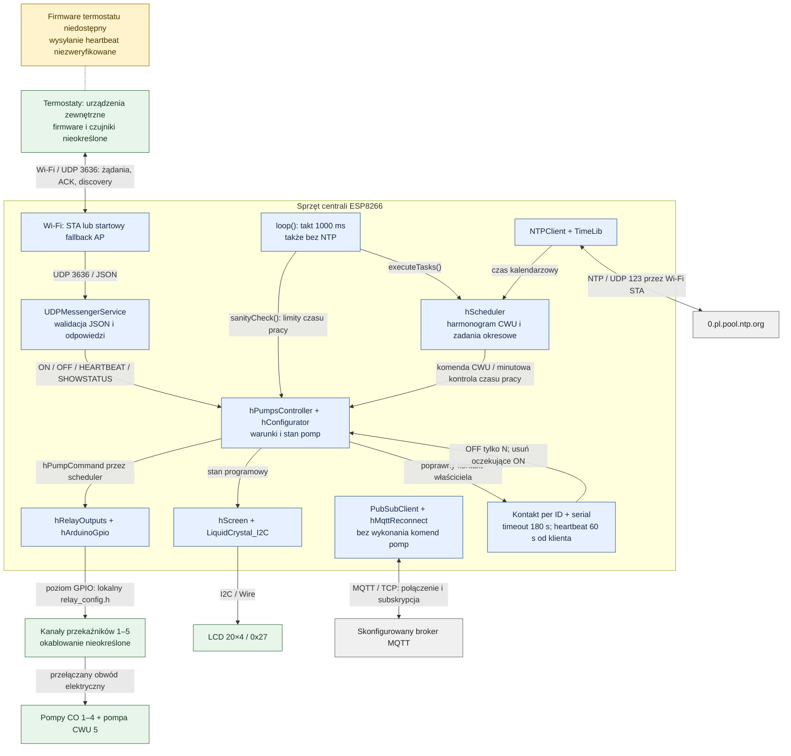
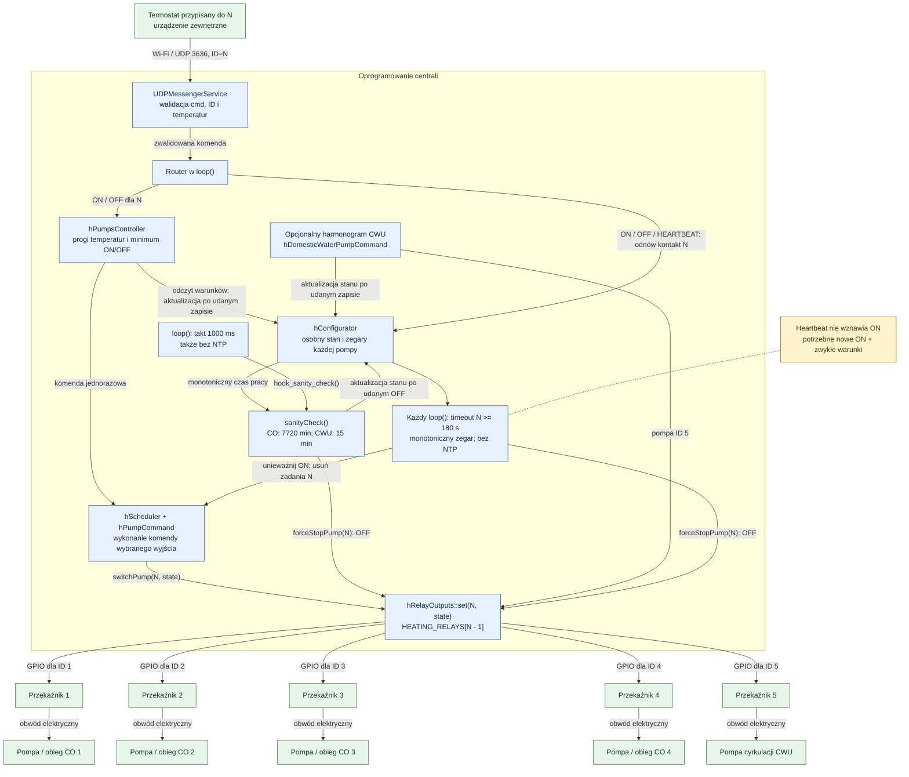

# Architektura centrali

Polski | [English](ARCHITECTURE.md) | [README](../README.pl.md)

Dokument opisuje źródła centrali w `heating_server/`. Termostaty są zewnętrznymi
klientami, których firmware, płytki i modele czujników nie są zidentyfikowane
w repozytorium. Diagramy pokazują role programowe i sprzętowe; fizyczne
okablowanie przekaźników nie jest potwierdzone, a przykładowe wyjścia pozostają
nieskonfigurowane.

## Komponenty

| Komponent | Odpowiedzialność i źródło |
| --- | --- |
| Centrala ESP8266 | `setup()` i `loop()` w [heating_server.ino](../heating_server/heating_server.ino); start, routing komend, okresowa obsługa |
| Usługa UDP | [udpmessengerservice.cpp](../heating_server/udpmessengerservice.cpp): walidacja JSON, oczekująca komenda, odpowiedzi i discovery |
| Controller pomp | `hPumpsController` w [scheduler.cpp](../heating_server/scheduler.cpp): warunki ON/OFF, limity czasu pracy i rejestracja harmonogramu CWU |
| Scheduler | `hScheduler` w [scheduler.h](../heating_server/scheduler.h): własność maksymalnie 512 zadań; harmonogramy minutowe, godzinowe, dzienne, tygodniowe i miesięczne |
| Stan/konfiguracja | `hConfigurator` w [heating_config.cpp](../heating_server/heating_config.cpp): stan pomp, monotoniczny czas pracy, historia przełączeń i stan MQTT; stałe w [heating_config.h](../heating_server/heating_config.h) |
| Wyjścia przekaźników | [relay_output.cpp](../heating_server/relay_output.cpp): walidacja kanałów, inicjalizacja OFF, zamiana ID pompy na GPIO i poziom aktywny; brak fizycznego sprzężenia zwrotnego |
| Wyświetlacz | [screen.cpp](../heating_server/screen.cpp): stan na LCD przez LiquidCrystal_I2C, 20×4 pod 0x27 |
| Sieć/czas | [utils.cpp](../heating_server/utils.cpp) i [runtime.h](../heating_server/runtime.h): startowe Wi-Fi/AP, NTP i reconnect MQTT |
| Harmonogram CWU | [createDailyPlan.cpp](../heating_server/createDailyPlan.cpp): opcjonalny dzienny harmonogram cyrkulacji |

Niebieskie węzły oznaczają oprogramowanie, zielone sprzęt, szare zewnętrzne
usługi sieciowe, a żółte uwagi o ograniczeniach implementacji.



MQTT jest połączeniem obecnym w firmware, a nie ścieżką sterowania pompami.
Domyślny port brokera to 1883 w `heating_config.h`; lokalna konfiguracja może
go nadpisać. `mqttCallback()` tylko loguje nieobsługiwaną komendę dla
skonfigurowanego tematu i danych o ograniczonej długości (≤512 B). Nie dekoduje
schematu sterowania ani nie przełącza wyjść. `formatThermostatTopic()` formatuje
`heating/sensors/thermostatN` ze skonfigurowanym prefiksem, ale `loop()` tylko
go wypisuje. `setTempFromMQTT()` potrafi utworzyć broadcast UDP `MQTTSET`;
żadne wywołanie w firmware nie łączy tej funkcji z callbackiem, a `MQTTSET`
nie jest akceptowaną komendą wejściową centrali.

## Mapowanie termostat → obieg → pompa

Pole `ID` wybiera pompę N (1–4), a `serial` musi odpowiadać wpisowi N
w lokalnym `HEATING_THERMOSTAT_SERIALS`. Fizyczne przypisanie do pomieszczeń
i obiegów pozostaje konfiguracją instalacji.

| ID żądania | Logiczny obieg / pompa | Wiersz konfiguracji przekaźników |
| --- | --- | --- |
| 1 | CO 1 | `HEATING_RELAYS[0]` |
| 2 | CO 2 | `HEATING_RELAYS[1]` |
| 3 | CO 3 | `HEATING_RELAYS[2]` |
| 4 | CO 4 | `HEATING_RELAYS[3]` |
| 5 | Cyrkulacja CWU; przez UDP tylko status | `HEATING_RELAYS[4]` |

Parser waliduje reprezentację ID i temperatur; HEARTBEAT wymaga ID 1–4
oraz dodatniego numeru seryjnego 32-bitowego. Router dopuszcza ON/OFF tylko dla
ID 1–4 przypisanych do numeru seryjnego; SHOWSTATUS obsługuje ID 1–5.
`hRelayOutputs::set()` sprawdza zakres przed wybraniem wiersza `pumpId - 1`.
`hConfigurator::registerClient()` rejestruje lokalne przypisanie, odrzuca
niepoprawne ID, zero, duplikat numeru seryjnego i zmianę istniejącego właściciela.
Pakiety nie rejestrują klientów. `serial` jest kopiowany do komendy;
`versionC` i wilgotność są ignorowane. IP/port nadawcy służy odpowiedzi,
więc zmiana IP po reconnect nie zmienia przypisania. UDP nie ma uwierzytelniania:
numer seryjny chroni przed przypadkowym pomieszaniem klientów, ale może zostać
podszyty. Protokół nie ma numeru sekwencji ani ochrony przed replay pakietów.

Każda pompa ma własny stan pracy, licznik czasu i minimalny odstęp przełączeń.
Żądanie ON/OFF dla N działa na N; `sanityCheck()` sprawdza każdą pompę
osobno. `_PRIORITY_ARRAY` jest zadeklarowane, ale nie realizuje arbitrażu ani
limitu jednoczesnych obiegów. Centrala, sieć i pętla są wspólne; osobny stan pomp
nie gwarantuje izolacji od zatrzymania wykonywania kodu centrali.

## Komponenty sterowania obiegami

Parametr N na diagramie to `ID` żądania (1–4). Timeout centrali działa
osobno dla każdego obiegu; wysyłanie heartbeat należy do zewnętrznego termostatu.



Połączenia GPIO/elektryczne opisują łańcuch skonfigurowanych wyjść, nie
zweryfikowane okablowanie. Przy przykładowej konfiguracji wszystkie kanały
mają stan `UNCONFIGURED`.

## Przebieg żądania i przełączenia

1. `listen()` odbiera datagram, a `processMessage()` udostępnia zwalidowaną
   `tClientCommand` z własną pamięcią. Niepoprawne dane pozostawiają oczekującą
   komendę i adres odpowiedzi bez zmian.
2. `loop()` pobiera komendę i przekazuje ON/OFF do
   `turnOnHeatPumpReq()` / `turnOffHeatPumpReq()`.
3. ON wymaga wyłączonej pompy, skończonych temperatur, zgody
   `canRestartPump()` i spełnienia obu nierówności:
   `actualTEMP <= targetTEMP + 0.7 + tempModifier` oraz
   `actualTEMP <= 28 + tempModifier`.
   Przy ustawionym zegarze `tempModifier=1` w godzinach 11–13,
   `tempModifier=-2` w godzinach 23–05; w pozostałych przypadkach wynosi 0.
   Godziny 22 i 06 są poza przedziałem nocnym. Centrala nie uruchamia samodzielnie
   pompy na podstawie zapamiętanych temperatur bez żądania ON.
4. OFF wymaga działającej pompy, skończonych pól temperatur i zgody
   `canStopPump()`; nie ma progu temperatury. Obecny minimalny czas ON
   i przerwa OFF wynoszą **1 minutę** (`_MIN_MINUTS_FROM_LAST_START`).
   `_DISABLE_MAX_ONOFF_VALIDATION=false` zachowuje te ograniczenia.
   Pierwsze ON po starcie centrali nie ma poprzedzającej przerwy OFF.
5. Jednorazowa `hPumpCommand` przechodzi przez `addExecuteTask()` i zapisuje
   wybrane wyjście przekaźnika. Pełny scheduler, błąd alokacji lub odrzucenie
   wyjścia zwracają niepowodzenie. Dopiero udane wykonanie aktualizuje stan pompy.
   Ponowne ON działającej pompy i OFF wyłączonej pompy zwracają `NO`.
6. Centrala odpowiada na IP/port żądania, podając wynikowe stany programowy
   i wyjścia. Otrzymanie ACK nie dowodzi pracy pompy.

`sanityCheck()` działa z monotonicznego taktu 1000 ms w `loop()` (oraz
minutowego callbacka schedulera). Wyłącza osobno każdą działającą pompę CO
przy `_MAX_HEATING_PUMP_RUNNING_MINUTES=7720` i CWU przy
`_DOMESTIC_WATER_PUMP_RUN_MINUTS=15`. Wymuszone OFF omija zwykłe minimum ON
i pojemność schedulera. Błąd OFF zachowuje stan/liczniki, więc następna
kontrola ponawia próbę. Czas pracy i minimalne odstępy używają rozszerzonego
`millis()`, tolerując pojedyncze przepełnienie 32-bitowe między aktualizacjami
i skoki NTP. Takt jest obsługiwany przez `loop()`, nie przez osobny sprzętowy
watchdog.

## Utrata i powrót komunikacji

Kontrakt zatwierdza heartbeat co **60 s**, także bez żądania grzania, i timeout
**180 s**. Centrala 0.3.0 implementuje odbiór HEARTBEAT i timeout; źródeł
firmware termostatu nie ma w repozytorium, więc jego nadawanie i reconnect
nie są zaimplementowane ani zweryfikowane tutaj.

Każdy prawidłowy HEARTBEAT, ON lub OFF przypisanego termostatu odnawia
ostatni kontakt N, również gdy zwykłe warunki sterowania odrzucają żądanie.
SHOWSERVER, SHOWSTATUS, błędne pakiety, nieznane ID, zły numer seryjny i ruch
innego klienta nie podtrzymują N. Discovery nie rejestruje klientów.
`checkThermostatTimeouts()` działa w każdej iteracji `loop()`, przed schedulerem
i odbiorem nowego pakietu, także bez ruchu sieciowego i bez NTP.
Przy czasie bez kontaktu >= 180 000 ms centrala unieważnia uprawnienie ON,
usuwa oczekujące zadania ON/OFF dla N i zapisuje OFF przez driver, omijając
minimum ON i pojemność schedulera. Generacja żądania blokuje także zachowaną
starą komendę po przyjęciu późniejszego ON. Pozostałe CO oraz harmonogram CWU
pozostają niezależne. Po błędzie zapisu OFF stan wyjścia pozostaje niezmieniony,
ON jest zablokowane, a następna iteracja ponawia OFF.

HEARTBEAT po timeoutcie odnawia kontakt, ale nie uruchamia pompy ani nie
przywraca starego ON. Potrzebne jest nowe ON otrzymane po timeoutcie, zgodne
z progami temperatury i minutową przerwą OFF po zatrzymaniu. Po restarcie
pamięć kontaktów i żądań jest pusta, skonfigurowane wyjścia startują OFF,
a CO wymaga poprawnego ON właściciela. Opcjonalny harmonogram CWU zachowuje
swoją osobną logikę. Utrata i odzyskanie kontaktu są logowane raz na zmianę
stanu. Czas używa rozszerzonego monotonicznego `millis()` z obsługą przepełnienia.

Termostat zgodny z kontraktem musi wysyłać HEARTBEAT co 60 s przez obsługę
monotonicznego timera, bez blokującego opóźnienia i bez zależności od zapotrzebowania.
Po reconnect musi odrzucić kolejkę starych ON; nowe ON może wynikać tylko ze
zwykłej logiki i aktualnych warunków. Tego zachowania klienta nie potwierdzają
symulowane pakiety testów centrali.

Reconnect MQTT i ponawianie NTP również używają **60 000 ms**, ale są osobnymi
mechanizmami. `MQTT_SOCKET_TIMEOUT=1` to timeout odpowiedzi **1 s**,
a `espClient.setTimeout(200)` to limit DNS/TCP **200 ms**. MQTT pozostaje
synchroniczne; zablokowana pętla opóźnia sprawdzenie timeoutu i obsługę obiegów.
Timeout realizuje pierwsza obsłużona iteracja przy lub po granicy 180 s;
rzeczywiste opóźnienia wymagają pomiaru na sprzęcie.

## Protokół UDP

UDP nasłuchuje na **3636**. Każde akceptowane żądanie, również SHOWSERVER
i SHOWSTATUS, zawiera `cmd`, `ID`, `actualTEMP` i `targetTEMP`:

```json
{"cmd":"SHOWSTATUS","ID":1,"actualTEMP":20.0,"targetTEMP":21.0}
```

To żądanie statusu nie przełącza wyjścia. Wielkość liter w komendach ma znaczenie:

| cmd | Zachowanie centrali |
| --- | --- |
| `ON` | Żądanie ON dla CO ID 1–4, z ograniczeniami; ACK unicast |
| `OFF` | Żądanie OFF dla CO ID 1–4, z ograniczeniami; ACK unicast |
| `HEARTBEAT` | Kontakt przypisanego CO ID 1–4; odnawia timer, bez przełączenia; ACK unicast |
| `SHOWSTATUS` | Status dla ID 1–5; poprawne ID zwraca OK, bez przełączenia |
| `SHOWSERVER` | Uruchomienie broadcastu discovery centrali; bez rejestracji klienta i zwykłego ACK |

ON/OFF i HEARTBEAT wymagają `serial` zgodnego z lokalnym przypisaniem.
Numer seryjny to dodatnia liczba całkowita 1–4294967295 albo dziesiętny tekst
złożony z 1–10 cyfr. Parser zachowuje starsze ON/OFF bez `serial`, ale router
odpowiada NO i nie odnawia kontaktu. Niepoprawne podane `serial` odrzuca parser.
Przykłady (1001 jest fikcyjnym numerem przypisanym do ID 1):

```json
{"cmd":"HEARTBEAT","ID":1,"serial":"1001","actualTEMP":20.0,"targetTEMP":21.0}
```

```json
{"cmd":"ON","ID":1,"serial":"1001","actualTEMP":20.0,"targetTEMP":21.0}
```

Dla HEARTBEAT OK oznacza przyjęcie kontaktu, nie włączenie pompy.

Pakiet musi być pojedynczym kompletnym obiektem JSON o długości **1–512 B**,
bez osadzonego NUL ani danych po obiekcie poza białymi znakami JSON. Liczby JSON
i pełne ciągi liczbowe są przyjmowane. ID musi mieścić się w `int`, a temperatury
w skończonych wartościach `float`. Parser nie narzuca fizycznych zakresów
temperatur. Błędny JSON, brak pól, nieskończone liczby, nieobsługiwane komendy
i sekwencje `\uXXXX` są odrzucane. Zagnieżdżenie JSON i pojemność obiektu
ogranicza przypięta biblioteka ArduinoJson. Dodatkowe poprawne pola są ignorowane.

Pola ACK to `cmd=OK/NO`, `RUNNING=YES/NO`, `OUTPUT=ON/OFF/UNCONFIGURED`,
`TIME` (dziesiętna wartość zegara jako tekst) i `SERVERIP`.
Dla ON/OFF OK oznacza udane wykonanie zapisu skonfigurowanego wyjścia.
Dla SHOWSTATUS OK oznacza ID w dopuszczalnym zakresie; może towarzyszyć
UNCONFIGURED. RUNNING to stan programowy po komendzie; OUTPUT to ostatni znany
zadany stan wyjścia drivera. Nie ma informacji zwrotnej o styku przekaźnika,
przepływie ani silniku pompy. TIME może być niezsynchronizowany, jeżeli NTP
nie ustawiło zegara.

Discovery rozsyła `cmd=SHOW`, `SERVERIP` i `TIME` na port 3636. Implementacja
zastępuje ostatni oktet aktywnego IP wartością 255; nie oblicza broadcastu
z maski podsieci. Tryb AP używa `softAPIP()`, a pozostały `localIP()`.
Klient musi uwzględnić ten sposób adresowania discovery.

## Czas i granice działania

NTP używa `0.pl.pool.ntp.org` i stałego przesunięcia UTC+1 (3600 s), bez
automatycznej zmiany czasu letniego. Synchronizacja startowa wykonuje najwyżej
pięć prób i jest pomijana w trybie AP. Synchronizacja dzienna przypada na 00:10;
przy nieustawionym zegarze ponowienia są obsługiwane raz na minutę, gdy połączone
jest zewnętrzne Wi-Fi. Nieustawiony zegar wstrzymuje zadania kalendarzowe
i modyfikatory dzień/noc, ale nie przełączenia UDP ani monotoniczną kontrolę
czasu pracy.

Opcjonalny harmonogram CWU i jego flagę opisuje [README](../README.pl.md).
Temperatury 45/45 zapisywane przez `hDomesticWaterPumpCommand` są stałymi,
nie odczytami czujnika. Zadania schedulera używają dni tygodnia TimeLib 1–7;
miesięczne daty nieobecne w danym miesiącu są pomijane. Pominięte terminy nie są
odtwarzane; bieżąca zaplanowana minuta może wykonać się raz przed wyborem
następnego terminu w przyszłości. Cofnięcie NTP nie powtarza wykonanych terminów.

Źródła nie ustalają modelu płytki, pojemności flash, fizycznych nazw obiegów,
polaryzacji GPIO, kalibracji czujników ani elektrycznego sprzężenia zwrotnego.
[Konfiguracja i weryfikacja](../README.pl.md) opisują dostępne procedury
kompilacji i kontroli. Rootowe programy Windows nie potwierdzają działania
firmware termostatów ani fizycznej pracy centrali.
